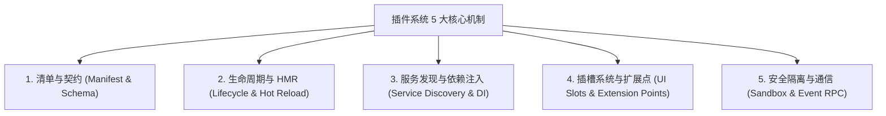

# GitHub 主流开源插件架构深度解析与 DSH 标准实践指南

> **前言**：在 GitHub 开源世界中，插件架构（Plugin Architecture / Microkernel Pattern）是构建超大规模、可无限扩展系统的核心基石。从 VS Code、Obsidian，到 Vite、Cordis 及最新的 DeepSeek Harness (DSH)，优秀的插件体系能够在保持核心微小稳定的同时，赋予第三方生态无尽的生命力。
> 本报告系统复盘 GitHub 顶级开源项目的插件设计模式，提炼通用架构法则，并给出 DSH 原生插件的最优实践标准。

---

## 目录
1. [开源世界四大插件架构流派](#一-开源世界四大插件架构流派)
2. [插件系统五大核心机制全景解构](#二-插件系统五大核心机制全景解构)
3. [GitHub 经典插件项目源码级解剖](#三-github-经典插件项目源码级解剖)
4. [AI Agent 时代的新型插件范式：从 Tool 到 Harness](#四-ai-agent-时代的新型插件范式从-tool-到-harness)
5. [DSH / Cordis 插件开发标准规范与落地指南](#五-dsh--cordis-插件开发标准规范与落地指南)

---

## 一、 开源世界四大插件架构流派

纵观 GitHub 上 Star 过万的插件系统，主要分为以下四大经典流派：

```text
┌─────────────────────────────────────────────────────────────────────────────────────────┐
│                               GitHub 插件架构四大流派演进                                │
├──────────────────────┬──────────────────────┬──────────────────────┬────────────────────┤
│ 流派 1：进程隔离流派  │ 流派 2：视图插槽流派  │ 流派 3：流水线钩子流派│ 流派 4：微内核 IoC │
│ (VS Code / Chrome)   │ (Obsidian / Figma)   │ (Vite / Webpack)     │ (Cordis / DSH)     │
├──────────────────────┼──────────────────────┼──────────────────────┼────────────────────┤
│ • 独立进程 Extension │ • 同主线程组件生命周期│ • 中间件/流式 AST 转换│ • 依赖注入与服务总线│
│ • JSON-RPC 通信      │ • DOM/Component 挂载 │ • Tapable 串/并行钩子 │ • 零重启 HMR 热插拔│
│ • 崩溃不影响主界面   │ • 零通信开销，响应极快│ • 专注于构建与代码变换│ • 面向 Agent 全插件│
└──────────────────────┴──────────────────────┴──────────────────────┴────────────────────┘
```

### 1. 进程隔离与声明式扩展流派（代表：VS Code、Eclipse）
- **核心思想**：插件代码不在 UI 主进程运行，而是在独立的 `Extension Host` 进程中运行。通过 IPC / JSON-RPC 进行消息传递。
- **优势**：哪怕某个插件发生死循环或崩溃，主编辑器界面依然流畅，安全性极高。
- **特征**：在 `package.json` 中通过声明式的 `contributes` 字段（如 `commands`、`menus`、`views`）向宿主提前登记能力，宿主按需激活（Lazy Activation）。

### 2. 视图插槽与轻量组件流派（代表：Obsidian、Figma、Notion）
- **核心思想**：基于 Web 技术栈，插件是一个继承了 `Plugin` 基类的类，提供 `onload()` 和 `onunload()` 生命周期。
- **优势**：轻量直接，插件可以直接使用宿主暴露的 UI Slot（状态栏、侧边栏、右键菜单、视图容器），开发上手门槛极低。
- **特征**：强依赖宿主环境的 `Workspace` 与 `Vault` 对象，具备即开即关的热卸载能力。

### 3. 流水线与事件驱动流派（代表：Vite、Rollup、Webpack、Babel）
- **核心思想**：插件本质是一组预定义“钩子函数（Hooks）”的集合（如 `resolveId`、`load`、`transform`）。
- **优势**：基于流水线管道（Pipeline）处理，每个插件接收上一阶段的输出并转换后传递给下一阶段。
- **特征**：采用 Bail（熔断）、Waterfall（瀑布流）、Parallel（并行）等钩子调用模型。

### 4. 控制反转 (IoC) 与微内核流派（代表：Cordis、Koishi、DeepSeek Harness）
- **核心思想**：“一切皆插件，核心无特权”。宿主仅负责插件加载、依赖解析与事件调度，所有业务功能（包括模型适配器、工具注册、会话存储、UI 界面）全由平级插件挂载实现。
- **优势**：系统具备极致的灵活性，支持通过配置文件（如 `cordis.patch.yml`）实现**零重启毫秒级 HMR 热插拔**。

---

## 二、 插件系统五大核心机制全景解构

无论哪种流派，一个完备的企业级插件体系必须具备以下五大核心机制：



### 1. 清单契约（Manifest & Schema）
- **作用**：告诉宿主“我是谁、我依赖谁、我提供什么能力、在什么时机激活我”。
- **标准做法**：在 `package.json` 中扩展命名空间字段（如 `dsh`、`contributes`），声明宿主入口（Host Entry）、客户端入口（Client Entry）、依赖的服务列表（`inject`）及分类标签。

### 2. 生命周期与热插拔（Lifecycle & HMR）
标准的插件生命周期状态流转图：
$$\text{Discover} \xrightarrow{\text{解析清单}} \text{Load} \xrightarrow{\text{依赖就绪}} \text{Apply / Activate} \xrightarrow{\text{运行态}} \text{Dispose / Deactivate}$$
- **关键要求**：插件在 `dispose` 时必须清理所有注册的事件监听器、定时器、DOM 节点与子进程，避免内存泄漏。

### 3. 服务发现与依赖注入（Service Discovery & DI）
- **痛点**：插件 A 想调用插件 B 提供的能力，但不知道插件 B 是否已加载。
- **解法（以 Cordis 为例）**：
  - 插件 A 声明 `export const inject = ["database", "logger"]`；
  - 宿主容器保证当且仅当 `ctx.database` 与 `ctx.logger` 就绪时才激活插件 A；
  - 插件 B 声明 `ctx.provide("database")` 提供服务。

### 4. 插槽系统与扩展点（UI Slots & Extension Points）
- **设计原则**：宿主不在核心写死 UI 位置，而是留出标准锚点（Slots）：
  - `workbench.sidebar.item`（侧边栏主图标）
  - `workbench.panel`（侧边抽屉工作台）
  - `global.overlay`（全局悬浮遮罩/任务中心）
  - `conversation.action`（聊天消息操作栏）

### 5. 安全隔离与通信（Sandbox & Event RPC）
- 在客户端与宿主分离的架构中，通常建立基于 WebSocket 或 EventEmitter 的全双工 RPC 通道，保证主进程与渲染层安全双向通信。

---

## 三、 GitHub 经典插件项目源码级解剖

### 案例 1：VS Code 插件架构（`microsoft/vscode`）
```json
// package.json (声明式扩展)
{
  "name": "my-extension",
  "activationEvents": ["onCommand:myExt.start"],
  "main": "./dist/extension.js",
  "contributes": {
    "commands": [{ "command": "myExt.start", "title": "Start Extension" }],
    "viewsContainers": { "activitybar": [{ "id": "my-sidebar", "title": "My View" }] }
  }
}
```
**启示**：静态清单声明使 VS Code 在启动时无需加载所有插件代码，仅在触发 `activationEvents` 时才懒加载，保障启动速度。

### 案例 2：Obsidian 插件架构（`obsidianmd/obsidian-sample-plugin`）
```typescript
import { Plugin } from "obsidian";
export default class MyPlugin extends Plugin {
  async onload() {
    this.addRibbonIcon("dice", "Roll Dice", () => this.roll());
    this.addSettingTab(new MySettingTab(this.app, this));
  }
  onunload() {
    // 自动清理注册的 DOM 与事件
  }
}
```
**启示**：极简的 OOP 继承与上下文注入（`this.app`），让开发者在 10 行代码内就能注入 UI。

### 案例 3：Cordis / Koishi 微内核（`cordisjs/cordis`）
```typescript
import { Context, Service } from "cordis";

export const inject = ["database"]; // 依赖声明

export function apply(ctx: Context) {
  ctx.on("ready", () => { ... });
  ctx.plugin(subPlugin); // 递归挂载子插件树
}
```
**启示**：基于函数的 `apply(ctx)` 范式，支持插件树形分层管理，天然契合 HMR 与配置驱动。

---

## 四、 AI Agent 时代的新型插件范式：从 Tool 到 Harness

结合 2026 前沿《Learn Harness Engineering》理论，AI 时代的插件系统正在发生三大质变：

| 维度 | 传统插件 (Traditional Plugins) | AI Harness 插件 (Agent-Era Plugins) |
| :--- | :--- | :--- |
| **交互对象** | 人类用户 (点击按钮、输入表单) | **大模型 + 人类双重消费** (Model-Facing & Human-Facing) |
| **核心产物** | UI 组件、菜单项、快捷键 | **Agent Tools (函数调用 Schema) + 上下文注入 (System Prompt)** |
| **生命周期切面** | 页面加载、按钮点击、路由跳转 | **`turn/start` ➔ `assemble` ➔ `pre-step` ➔ `tool/call`** |
| **记忆与学习** | 本地静态配置文件 (config.json) | **长期认知记忆飞轮 (Pattern Memory & Self-Healing)** |

在 DeepSeek Harness (DSH) 中，插件不仅提供侧边栏 UI，更重要的是向 Agent 暴露 **Capability Seams（能力接缝）**。模型可以通过自然语言直接调用插件的工具函数，插件也能在 `assemble` 阶段向模型的 Prompt 注入环境记忆。

---

## 五、 DSH / Cordis 插件开发标准规范与落地指南

基于上述 GitHub 最佳实践，我们在 `@godsh/dsh-plugin` 中落地了 **DSH 原生插件标准工程脚手架**：

### 1. 标准目录结构
```text
my-dsh-plugin/
├── package.json              # 声明 dsh.entry 双入口与 dsh.client.inject
├── cordis.patch.yml          # 本地热调试 patch 声明
├── src/
│   ├── index.ts              # 宿主 Host 入口 (apply 挂载服务与 Agent Tools)
│   ├── service.ts            # Service 接口实现
│   ├── types.ts              # Schema 与类型契约
│   ├── memory.ts             # 长期记忆与 assemble 钩子
│   └── client/
│       └── index.ts          # 客户端 Client 入口 (UI Slots 注册)
└── dist/
    ├── index.mjs             # 自包含宿主 Bundle (esbuild 产物)
    └── client.mjs            # 自包含客户端 Bundle
```

### 2. `package.json` 标准规范
```json
{
  "name": "@godsh/dsh-plugin",
  "version": "0.4.1",
  "type": "module",
  "exports": {
    ".": "./dist/index.mjs",
    "./client": "./dist/client.mjs"
  },
  "main": "./dist/index.mjs",
  "dsh": {
    "entry": {
      "host": "./dist/index.mjs",
      "client": "./dist/client.mjs"
    },
    "client": {
      "inject": [
        "@deepseek-ai/dsh-client-ui-slots",
        "@deepseek-ai/dsh-client-ui-settings"
      ]
    },
    "category": "dev",
    "tags": ["manager", "workflow", "tools", "memory"]
  }
}
```

### 3. 宿主服务与 Agent Tool 注册规范 (`src/service.ts`)
```typescript
import { Context } from "@deepseek-ai/cordis";

export function apply(ctx: Context) {
  // 1. 挂载原生 Service
  ctx.provide("myService");
  ctx["myService"] = new MyService();

  // 2. 注册面向 AI 模型的动态 Tool
  ctx.emit("agent:register-tool", {
    name: "my_action_tool",
    description: "让 AI 模型可以执行特定环境治理操作",
    parameters: {
      type: "object",
      properties: { target: { type: "string" } },
      required: ["target"]
    },
    handler: async (args) => {
      return { ok: true, result: "Executed successfully" };
    }
  });

  // 3. 监听 DSH 事件管道 (注入长期记忆)
  ctx.on("assemble", (event) => {
    if (event && event.systemPrompt) {
      event.systemPrompt += "\n[长期环境偏好已注入]\n";
    }
  });
}
```

### 4. 客户端 UI 插槽注入规范 (`src/client/index.ts`)
```typescript
export function apply(ctx: any) {
  if (!ctx.slots) return;

  // 挂载到 DSH 左侧导航栏
  ctx.slots.register("workbench.sidebar.item", () => ({
    id: "my-plugin-sidebar",
    title: "我的控制台",
    icon: "⚡",
    component: "MySidebarDrawer"
  }));

  // 挂载到右下角常驻任务 HUD
  ctx.slots.register("global.overlay", () => ({
    id: "my-floating-hud",
    component: "MyFloatingHud"
  }));
}
```

---

## 总结与行动建议

1. **架构同构**：无论 VS Code、Obsidian 还是 DSH，插件的核心是**“契约解耦、按需激活、状态自闭环”**；
2. **双模并进**：面向 AI（Tool + Prompt 注入）与面向人类（Slot + HMR UI）结合，是 2026 年后所有智能体插件的演进方向；
3. **自包含打包**：在分发插件时使用 `esbuild` 预打包为自包含 ESM 模块，是消除跨目录依赖解析故障的最佳实践。
