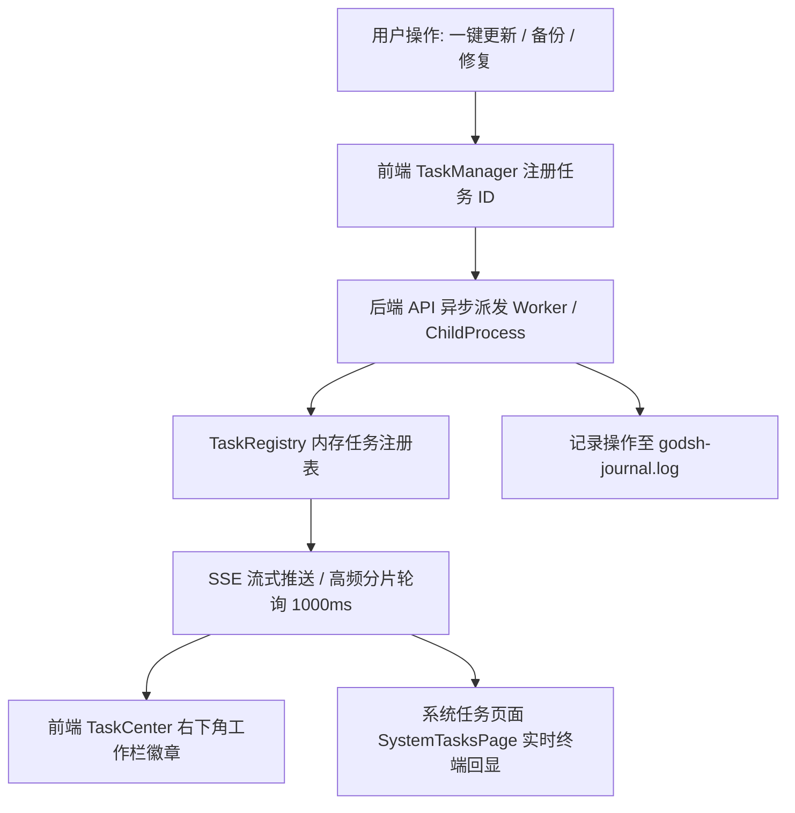
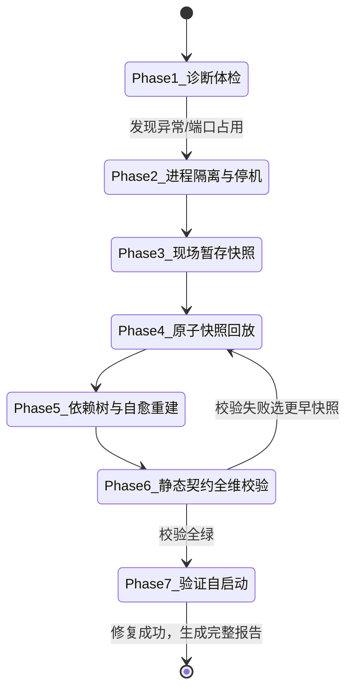

# godsh 升级为“环境可靠性中心”详细升级方案 (v0.5.5)

> **版本定位**：v0.5.5  
> **核心使命**：将 godsh 从单纯的“环境启动管理工具”全面升格为具备**高可靠性、全维可观测性与自动化自愈修复能力**的**“DSH 环境可靠性中心（Reliability & Control Center）”**。  
> **协作基石**：全流程遵循 **J-Space Workspace Ledger** 规范演进，全量跟踪状态机与审计历史。

---

## 目录

- [一、背景与升级目标](#一背景与升级目标)
- [二、模块一：修复核心缺陷 —— 沙箱更新与系统任务进程可视化](#二模块一修复核心缺陷--沙箱更新与系统任务进程可视化)
  - [1.1 沙箱（Vault）更新失败与静默吞错根治](#11-沙箱vault更新失败与静默吞错根治)
  - [1.2 全局“系统任务”（System Tasks）工作进程中枢](#12-全局系统任务system-tasks工作进程中枢)
- [三、模块二：构建备份与回退体系 —— 环境“时光机”与自愈工作流](#三模块二构建备份与回退体系--环境时光机与自愈工作流)
  - [2.1 软件备份系统（Profile 时光机快照）](#21-软件备份系统profile-时光机快照)
  - [2.2 引导式“修复工作流 Agent”（自愈修复引擎）](#22-引导式修复工作流-agent自愈修复引擎)
  - [2.3 godsh 结构化日记（Journaling）与生命周期数据保留策略](#23-godsh-结构化日记journaling与生命周期数据保留策略)
- [四、模块三：UI/UX 设计升级 —— 集成 UI-UX-Pro-Max 智能设计规范](#四模块三uiux-设计升级--集成-ui-ux-pro-max-智能设计规范)
  - [3.1 设计系统推导结论（基于 dsh-ui-ux-pro-max / design_recommend）](#31-设计系统推导结论基于-dsh-ui-ux-pro-max--design_recommend)
  - [3.2 核心页面重构交互方案](#32-核心页面重构交互方案)
  - [3.3 交付前 UI/UX 检查清单（基于 design_review 规范）](#33-交付前-uiux-检查清单基于-design_review-规范)
- [五、模块四：功能兼容性 —— 深度打通 DSH Desktop 官方桌面端](#五模块四功能兼容性--深度打通-dsh-desktop-官方桌面端)
  - [5.1 源码级根因深度剖析（10_dsh-desktop-master）](#51-源码级根因深度剖析10_dsh-desktop-master)
  - [5.2 兼容改造与状态同步方案](#52-兼容改造与状态同步方案)
  - [5.3 前端启动器双通道选项与交互呈现](#53-前端启动器双通道选项与交互呈现)
- [六、模块五：工程打包、验证与 GitHub v0.5.5 发布流水线](#六模块五工程打包验证与-github-v055-发布流水线)
  - [6.1 本地编译与全量单测验证流程](#61-本地编译与全量单测验证流程)
  - [6.2 本地发布打包（make-release.ps1）](#62-本地发布打包make-releaseps1)
  - [6.3 Git 版本控制与 GitHub Actions 自动云端构建部署](#63-git-版本控制与-github-actions-自动云端构建部署)
  - [6.4 GitHub Release v0.5.5 发布说明范本](#64-github-release-v055-发布说明范本)

---

## 一、背景与升级目标

在 DSH 生态的实际生产实践中，开发者经常面临环境依赖损坏、第三方插件版本冲突、后台长时间任务无状态可查、以及误操作后无法回退的严重痛点。原有的 godsh 虽然提供了基础的环境启停和插件挂载能力，但在可靠性保障层面仍存在“黑盒执行”、“故障难以自愈”与“破坏性操作不可逆”的瓶颈。

本次 **v0.5.5** 升级旨在打破这些局限，确立四大可靠性支柱：
1. **执行确定性（Determinism）**：杜绝静默失败与死引用，所有沙箱升级均具备物理验真、原子生效与子任务报告；
2. **全维可观测（Observability）**：建立独立的“系统任务”中心，支持高频流式日志回显与任务生命周期受控管理；
3. **环境可逆性（Reversibility）**：引入 Profile 时光机与轻量级快照机制，前置拦截破坏性变更，配套 7 阶段自动化自愈工作流 Agent；
4. **生态互通性（Interoperability）**：深度对齐 DSH Desktop 原生启动标准与配置契约，实现双轨启动自由切换。

---

## 二、模块一：修复核心缺陷 —— 沙箱更新与系统任务进程可视化

### 1.1 沙箱（Vault）更新失败与静默吞错根治

#### 1.1.1 现状缺陷剖析
在 `packages/plugin-registry/src/vault.ts` 中：
- **悬空引用问题**：`vault.json` 中持久化记录了 `installedProfiles`（历史已挂载的环境列表）。当用户通过外部文件系统物理删除了某个环境（例如 `test-profile`），`updatePlugin` 遍历 `installedProfiles` 逐个调用 `deployToProfile` 时会抛出 `ENOENT`。
- **错误被静默吞掉**：虽然此前版本增加了 `try-catch`，但在发生异常时仅通过 `console.error` 输出，返回结构中缺少对环境维度的状态沉淀，上层的 `updateAll` 仅统计插件级别的成功数量，导致 UI 误导性地提示“全量更新成功”，而实际核心业务环境并未生效软链与配置刷新。

#### 1.1.2 改造实施方案

1. **执行前物理验真（Pre-flight Profile Verification）**：
   在执行任何插件升级、挂载同步前，强制执行环境验真与脏数据清理：
   ```typescript
   export interface ProfileSyncStatus {
     profile: string
     status: 'synced' | 'failed' | 'pruned'
     error?: string
   }

   export function pruneDanglingProfiles(
     plugin: VaultPlugin,
     profilesDir: string,
     onLog?: (msg: string) => void
   ): string[] {
     const validProfiles: string[] = []
     const pruned: string[] = []

     for (const prof of plugin.installedProfiles || []) {
       const profDir = join(profilesDir, prof)
       const pkgPath = join(profDir, 'package.json')
       if (existsSync(profDir) && existsSync(pkgPath)) {
         validProfiles.push(prof)
       } else {
         pruned.push(prof)
       }
     }

     if (pruned.length > 0) {
       onLog?.(`[清理] 插件 ${plugin.name} 移除已不存在的环境引用: ${pruned.join(', ')}\n`)
     }
     return validProfiles
   }
   ```

2. **原子化子任务与结构化报告（Granular Subtask Reporting）**：
   重构 `updatePlugin` 与 `updateAll` 的返回值契约：
   ```typescript
   export interface PluginUpdateReport {
     id: string
     name: string
     ok: boolean
     fromVersion?: string
     toVersion?: string
     error?: string
     profileResults: {
       profile: string
       status: 'synced' | 'failed' | 'pruned'
       reason?: string
     }[]
   }

   export interface UpdateAllReport {
     total: number
     updated: number
     failed: number
     results: PluginUpdateReport[]
   }
   ```
   在更新过程中，针对每个已挂载环境执行独立子任务，并将失败细节保留在 `profileResults` 中；UI 根据此报告呈现展开式状态标签（如 `dshcoding (成功)`、`web (更新失败: EPERM 锁定)`），使用户对变更一目了然。

---

### 1.2 全局“系统任务”（System Tasks）工作进程中枢

#### 1.2.1 架构设计理念
目前后台长任务（沙箱全量拉取更新、环境完整备份、环境批量修复、依赖自愈）缺乏集中看板。我们将在前端建立独立的 **`系统任务` (SystemTasksPage)**，并提升泛化 `TaskManager` 单例。



#### 1.2.2 详细设计细节

1. **后端标准任务接口体系**（在 `apps/launcher/src/routes/tasks.ts` 新建）：
   - `GET /api/tasks`：获取系统任务列表（支持按 `status: running | done | error | cancelled` 过滤）。
   - `GET /api/tasks/:id`：获取特定任务的最新进度（`progress: 0-100`）、状态及日志增量切片。
   - `GET /api/tasks/:id/stream`：基于 **SSE (Server-Sent Events)** 的高吞吐实时日志流，客户端建立 `EventSource` 后即刻订阅实时输出。
   - `POST /api/tasks/:id/cancel`：对于长时间运行或异常挂起的任务，后端向关联的子进程触发 `kill()` 或调用 `AbortController.abort()`，实现受控安全取消。

2. **前端通用任务模型泛化**（在 `apps/shell-web/src/tasks.ts` 扩展）：
   ```typescript
   export type TaskType =
     | 'vault-update-all'
     | 'vault-update'
     | 'profile-backup'
     | 'repair-workflow'
     | 'dsh-heal'
     | 'batch-install'
     | 'kernel-switch'

   export interface GlobalTask {
     id: string
     type: TaskType
     title: string
     profile?: string
     status: 'running' | 'done' | 'error' | 'cancelled'
     progress: number // 0 ~ 100 百分比
     message?: string
     log: string
     createdAt: number
     updatedAt: number
     canCancel?: boolean
     meta?: Record<string, unknown>
   }
   ```

3. **前端 `SystemTasksPage.tsx` 页面功能规划**：
   - **顶部仪表盘**：展示当前并发运行中任务数、今日已完成任务数、失败预警数。
   - **分栏布局**：
     - **左侧：任务时间线列表**（虚拟滚动，按时间倒序排列，包含任务图标、类型标签、关联 Profile、执行耗时、百分比进度条、状态徽章、操作区：取消/重新执行/删除）。
     - **右侧：深度日志观察终端（Terminal Log Inspector）**。集成黑底等宽终端视窗，具备：
       - ANSI 颜色高亮解析；
       - “自动滚动至底部”开关；
       - “复制全部日志”与“导出为 .log 文件”按钮；
       - 结构化错误分段标红；
       - 任务报告摘要卡片（包含影响插件数、受影响环境列表、耗时分析）。

---

## 三、模块二：构建备份与回退体系 —— 环境“时光机”与自愈工作流

### 2.1 软件备份系统（Profile 时光机快照）

#### 2.1.1 存储结构与元数据定义
每个 Profile 拥有独立的快照目录树，存储在用户数据目录下：
`%APPDATA%\godsh\backups\<profile-name>\<snapshot-id>\`

```
%APPDATA%\godsh\backups\web\snap-1725800000000-4f2a\
├── snapshot.json           # 快照元数据定义
├── package.json            # 锁定 dependencies 与 dsh.profile.bundles
├── cordis.patch.yml        # 插件启禁用及自定义 YAML 参数
└── pnpm-workspace.yaml     # 工作区锁定文件（若存在）
```

**`snapshot.json` 数据规格**：
```json
{
  "id": "snap-1725800000000-4f2a",
  "profile": "web",
  "timestamp": 1725800000000,
  "createdAt": "2026-09-08T18:45:00.000Z",
  "trigger": "auto-pre-update",
  "triggerLabel": "沙箱全量升级前自动备份",
  "description": "升级前自动创建的安全时光机快照",
  "godshVersion": "0.5.5",
  "dshVersion": "0.1.2-rc.1",
  "isLocked": false,
  "metrics": {
    "dependenciesCount": 10,
    "bundlesCount": 12,
    "patchEntriesCount": 9
  },
  "hashes": {
    "packageJsonSha256": "e3b0c44298fc1c149afbf4c8996fb92427ae41e4649b934ca495991b7852b855",
    "patchYmlSha256": "ca978112ca1bbdcafac231b39a23dc4da786eff8147c4e72b9807785afee48bb"
  }
}
```

#### 2.1.2 双轨触发机制
1. **手动快照**：
   - 开发者在 Profile 详情卡片点击 `⏱️ 创建时光机快照`；
   - 弹出模态框输入自定义描述（例如：“安装测试插件前的基线版本”）；
   - 毫秒级物理复制核心配置文件并写入元数据。
2. **预操作自动快照（Pre-op Auto Snapshot 防御机制）**：
   - 在触发以下破坏性操作前，后端切面强制先建立快照：
     - `vault.updateAll` 或 `vault.updatePlugin`（沙箱包更新）；
     - `allocations.allocate` 或 `allocations.removeAllocation`（插件挂载与卸载）；
     - `kernelManager.switchKernel`（内核版本变更）；
     - `dshDoctor.heal`（自愈修复执行前）。
   - 记录快照 ID 到当前操作的上下文链条，一旦后续子任务发生致命崩溃，系统即刻弹窗提示：“检测到操作异常，是否一键回退至执行前快照？”

---

### 2.2 引导式“修复工作流 Agent”（自愈修复引擎）

当 DSH 环境因意外断电、依赖缺失、端口冲突或坏补丁导致无法启动（例如著名的“重启后无法打开 web”事故），普通用户往往束手无策。我们设计一套**小型自动化修复 Agent 状态机**，替代粗暴的文件覆盖。



#### 2.2.1 修复工作流 7 阶段详解

- **Phase 1: 故障体检与特征捕获（Diagnostic Inspection）**
  运行内置诊断探针：检查 `runtime.json` 残留、WMI 孤儿 Node/dsh 进程、检测目标 Profile 端口（如 5173、3000、4780）是否被占，解析 `cordis.patch.yml` 语法合法性与 `package.json` 的 `dsh.profile.bundles` 顺序。
- **Phase 2: 进程隔离与优雅停机（Safe Quarantine & Termination）**
  向目标 Profile 发送 SIGTERM；若 3 秒内未退出，调用底层 `killAllProfileProcesses`，结合 `netstat -ano` 探测强杀锁定端口的残留 PID，彻底释放文件锁。
- **Phase 3: 事故现场快照（Incident Checkpoint）**
  自动为损坏现场留存一份 `snap-incident-<timestamp>`，防止在修复过程中丢失用户现场代码，确保任何修复操作自身 100% 可逆。
- **Phase 4: 原子快照回放（Atomic Snapshot Rollback）**
  用户确认目标回退快照后，通过带临时备份的写入管道，将快照内的 `package.json`、`cordis.patch.yml` 原子覆盖回 Profile 目录。
- **Phase 5: 依赖重建与死链自愈（Dependency Heal & Junction Relink）**
  扫描 Profile 下 `node_modules`：
  - 清理损坏的 NTFS Junction 软链（如指向已不存在的 temp 路径）；
  - 调用 `@godsh/core` 的 `ensureProfileBundles` 补齐官方核心包；
  - 触发 `pnpm install --no-frozen-lockfile` 自动补全真实物理依赖。
- **Phase 6: 静态契约合规审查（Verification & Gate Check）**
  执行门禁防线：
  - 审查 `bundles` 中 `@deepseek-ai/dsh-base` 是否严格排在 `@deepseek-ai/dsh-web-app` 之前；
  - 确认绝无 `dsh-plugin-desktop`（兼容 DSH Desktop）；
  - 验证 `cordis.patch.yml` 是否为合法 YAML 数组 `[]`。
- **Phase 7: 环境唤醒与健康复测（Boot & Verified Report）**
  以受控方式拉起环境，连续 3 次探测健康端点（HTTP 200 或端口就绪）。成功后向“系统任务”中心提交绿色通过报告，并在桌面弹出修复成功的系统通知。

---

### 2.3 godsh 结构化日记（Journaling）与生命周期数据保留策略

#### 2.3.1 日记审计设计
- **日志路径**：`%APPDATA%\godsh\data\logs\godsh-journal.jsonl`（同时落盘纯文本版 `godsh-journal.log`）。
- **每条记录字段**：
  `{ timestamp, level, category: 'snapshot' | 'rollback' | 'vault' | 'repair' | 'desktop-launch', profile, action, status: 'success' | 'failed', details, operator: 'user' | 'agent' | 'system' }`

#### 2.3.2 快照淘汰与空间保护策略（Retention Policy）
在设置页面（SettingsPage）增加**时光机策略控制板**：
- **数量限制**：每个 Profile 默认保留最近 10 个快照（超额自动剔除最旧的未锁定快照）。
- **时间限制**：自动归档并清理超过 14 天的非标星快照。
- **快照加锁保护（Pin/Lock）**：用户可在 UI 上点击小锁图标将关键稳定基线“永久锁定”，受保护快照不受任何自动清理规则影响。
- **磁盘占用可视化**：直观展示快照占用空间（通常每个快照仅几 KB 至几十 KB），提供“一键安全瘦身”按钮。

---

## 四、模块三：UI/UX 设计升级 —— 集成 UI-UX-Pro-Max 智能设计规范

### 4.1 设计系统推导结论（基于 `dsh-ui-ux-pro-max` / `design_recommend`）

我们通过调用 `dsh-ui-ux-pro-max` 针对项目定位（*“环境管理控制中心、开发者工具、任务进程、备份恢复、玻璃拟态”*，密度：`8 - 紧凑/看板`）进行深度推导，确立以下设计规范：

```
✦ 风格体系：Cinematic Dark（深色电影级） + Glassmorphism（现代微光玻璃拟态）
✦ 视觉定位：专业级高可靠性开发者工具，严谨、沉浸、极低视觉噪点、高信息密度
```

#### 4.1.1 核心颜色令牌（Design Tokens）

| 语义令牌 (Token) | HEX / RGBA 真实数值 | 核心用途与搭配 |
| :--- | :--- | :--- |
| `--color-canvas-deep` | `#020203` | 底层全黑（杜绝纯 `#000000` 造成的 OLED 拖影，采用电影级深色） |
| `--color-surface-base` | `#0A0A0F` | 主体工作区背景，带微弱渐变底色 |
| `--color-glass-card` | `rgba(255, 255, 255, 0.04)` | 玻璃拟态卡片背景，搭配 `backdrop-filter: blur(16px)` |
| `--color-glass-elevated` | `rgba(255, 255, 255, 0.08)` | 悬停态/弹出层/抽屉背景，层次分明 |
| `--color-glass-border` | `rgba(255, 255, 255, 0.08)` | 1px 细发丝边框，高雅通透 |
| `--color-accent` | `#5E6AD2` | 主行为品牌靛蓝，极客专注色 |
| `--color-accent-glow` | `rgba(94, 106, 210, 0.25)` | 聚焦/高亮阴影发光（Box Glow） |
| `--color-success` | `#22C55E` | 正常运行/自愈通过/更新成功 |
| `--color-warning` | `#F59E0B` | 待更新新版本/环境未同步警告 |
| `--color-destructive` | `#EF4444` | 错误/终止/强杀/删除危险操作 |
| `--color-text-primary` | `#EDEDEF` | 顶级标题与核心文字，对比度 > 7:1 |
| `--color-text-muted` | `#8A8F98` | 辅助文字、时间戳、说明文案，对比度 > 4.5:1 |

#### 4.1.2 字体与排版层级（Typography）
- **UI 界面主字体**：`Inter, -apple-system, BlinkMacSystemFont, "Segoe UI", Roboto, sans-serif`，字重配置为 `400 (正文), 500 (标签), 600 (小标题), 700 (主标题)`。
- **代码与终端**：`"JetBrains Mono", "Cascadia Code", "Fira Code", monospace`，专用于路径、插件包名、日志流回显与版本号。

#### 4.1.3 高密度看板间距标尺（Density 8 Spacing Scale）
```css
--space-2xs: 2px;
--space-xs:  4px;
--space-sm:  8px;
--space-md:  12px;
--space-lg:  16px;
--space-xl:  24px;
--space-2xl: 32px;
```

---

### 4.2 核心页面重构交互方案

#### 4.2.1 全新页面：系统任务（`SystemTasksPage.tsx`）
- **状态统计微标条**：顶部 4 个胶囊徽章（全部任务、运行中 ⚡ 带脉冲绿光、已完成、异常警报）。
- **任务行卡片（Task Card）**：
  - 左侧：状态图标（转动动画 / 绿色勾选 / 红色警告）；
  - 中间：任务标题与副标题（如 `沙箱全量升级 · 3个环境同步中`），下方嵌入 4px 精致进度条（带微光流光效果）；
  - 右侧：耗时指示器 + 操作区（`[展开日志]`, `[取消]`, `[重试]`）。
- **可缩放抽屉终端（Log Drawer）**：
  - 点击卡片丝滑向下展开日志终端；
  - 顶部轻量工具条：`[全屏切换] [自动滚屏开/关] [复制全部] [清空记录]`。

#### 4.2.2 时光机快照与自愈面板（`SnapshotModal.tsx` & `RepairAgentModal.tsx`）
- **时间胶囊时间线（Timeline UI）**：
  - 左侧贯穿式光轴节点（蓝点=手动，紫点=自动防御快照，红点=事故留存）；
  - 卡片内标明变更对比（如：`+ 2个插件, ~ 1个版本升级, 依赖哈希已变`）；
  - 一键动作：`[一键回退到此处]`、`[对比差异]`、`[加锁/解锁]`。
- **修复工作流 Agent 对话卡片（Agent Repair Workflow UI）**：
  - 摒弃枯燥文本，采用智能步骤卡片（7 个步骤勾选自检）；
  - 步骤流转带平滑呼吸灯，错误步骤支持单步“点击重试并应用降级策略”。

---

### 4.3 交付前 UI/UX 检查清单（基于 `design_review` 规范）

- [x] **严禁 Emoji 作为结构功能图标**：全局导航与操作按钮统一采用矢量图标（SVG / Phosphor / Lucide 风格矢量组件）；
- [x] **物理按压反馈**：所有交互按钮均配置 `80~150ms` 物理缩放 `scale(0.98)` 与透明度微调；
- [x] **触摸热区合规**：所有可点按元素的最小触控热区保证 $\ge 44 \times 44\text{px}$；
- [x] **零横向滚动溢出**：对深层长文本（文件路径、包名、日志）设置 `text-overflow: ellipsis` 或 `break-all`，保障各分辨率下视口无横向跳动；
- [x] **四态完备性**：所有新组件完整设计 Default（正常）、Loading/Skeleton（骨架占位）、Empty（空状态插画与指引 CTA）、Error（错误回退按钮）；
- [x] **WCAG AA 暗色对比度**：正文文字与深色底板对比度达标 $7:1$，次要文字保证 $> 4.5:1$。

---

## 五、模块四：功能兼容性 —— 深度打通 DSH Desktop 官方桌面端

### 5.1 源码级根因深度剖析（`10_dsh-desktop-master`）

通过直接深度解析 `10_dsh-desktop-master源码文件/dsh-plugin-desktop/src/` 与 `11/packages/boot/app-boot/src/` 源码，我们发现了 DSH Desktop 无法打开 godsh 环境的**三大底层真相**：

1. **环境变量被完全忽略**：
   - godsh 先前在 `apps/launcher/src-tauri/src/lib.rs` 中尝试通过 `cmd.env("DSH_DESKTOP_DEFAULT_PROFILE", &profile)` 传递目标 Profile。
   - **源码事实**：`main.ts` 中 DSH Desktop GUI 启动时根本不读取该环境变量！该变量仅在终端模拟器下用于将 `dsh` CLI 默认别名绑定到环境。
2. **状态文件读取契约**：
   - DSH Desktop 启动时，强制从以下路径读取选择状态：
     `%APPDATA%\DSH Desktop\profile-selection\state.json`
   - 格式必须严格满足 `DesktopProfileStateV2`：
     ```json
     {
       "version": 2,
       "active": "<profile-name>"
     }
     ```
   - 若 godsh 不将选定 Profile 写入该文件，DSH Desktop 将永远启动上次记录的环境或硬编码回退到 `desktop`。
3. **极严苛的清单合规门禁（`webCapable` & `bundles` 校验）**：
   - `profile-manager.ts` 第 132~146 行明确规定：
     - **Bundle 顺序要求**：Profile 的 `package.json` 中的 `dsh.profile.bundles` 必须直接包含 `@deepseek-ai/dsh-base`，且 `@deepseek-ai/dsh-web-app` 必须严格排在 `dsh-base` 之后！若顺序颠倒或缺失，DSH Desktop 直接抛错并弹出 Recovery 窗口；
     - **Launcher-Owned 严禁侵入**：`DESKTOP_PACKAGE_NAMES`（包含 `dsh-plugin-desktop` 与 `dsh-plugin-desktop-beta`）属于桌面壳自身专属，**绝不允许出现在 Profile 的 bundles 中**；若存在，Desktop 会直接判定存在问题拒绝加载！

---

### 5.2 兼容改造与状态同步方案

在后端与 Tauri 层实施**启动前兼容性自动治愈机制**：

```rust
// apps/launcher/src-tauri/src/lib.rs 增强实现逻辑
fn sync_desktop_profile_state(profile: &str) -> Result<(), String> {
  let appdata = std::env::var("APPDATA").map_err(|_| "缺少 APPDATA 环境变量".to_string())?;
  let state_dir = PathBuf::from(&appdata).join("DSH Desktop").join("profile-selection");
  std::fs::create_dir_all(&state_dir).map_err(|e| format!("创建状态目录失败: {e}"))?;
  
  let state_file = state_dir.join("state.json");
  let json_content = format!("{{\n  \"version\": 2,\n  \"active\": \"{}\"\n}}\n", profile);
  std::fs::write(&state_file, json_content).map_err(|e| format!("写入 DSH Desktop 状态失败: {e}"))?;
  Ok(())
}
```

同时，在调用启动前，后端自动调用 `ensureDesktopCompatibility(profileDir)`：
1. 检查 `package.json`，若 `bundles` 中含有 `dsh-plugin-desktop` 或 `dsh-plugin-desktop-beta`，自动剥离；
2. 确保 `bundles` 头部前两位为 `["@deepseek-ai/dsh-base", "@deepseek-ai/dsh-web-app"]`；
3. 随后同步写出 `%APPDATA%\DSH Desktop\profile-selection\state.json`；
4. 注入正确的 `DSH_HOME` 路径并安全唤醒 `DSH Desktop.exe`。

---

### 5.3 前端启动器双通道选项与交互呈现

在前端 Profile 卡片（`ProfilesPage.tsx`）的启动控制区：

- **分体式启动按钮组（Split Button / Dropdown）**：
  - **主按钮（左侧大区域）**：`▶ 启动 (godsh)` —— 默认通道，走内建轻量 Web 进程管理，支持实时日志捕获；
  - **下拉触发器（右侧小箭头）**：点击弹出上下文菜单：
    - `🖥️ 通过 DSH Desktop 启动`（官方完整桌面壳体验）；
    - `🌐 在浏览器中打开 (独立应用模式)`；
    - `⚙️ 设为默认启动方式`。
- **智能可用性探针**：
  - 前端向后端查询 `GET /api/system/dsh-desktop-status`；
  - 若本机未安装 DSH Desktop，该选项置灰并显示 `(未安装 DSH Desktop)`，悬停显示官方下载/安装指引超链接。

---

## 六、模块五：工程打包、验证与 GitHub v0.5.5 发布流水线

### 6.1 本地编译与全量单测验证流程

在项目根目录执行全套闭环校验指令：

```powershell
# 1. 切换至项目主目录
cd C:\Users\Shengmingkai\Desktop\dsh__launcher\00_主项目_当前版本\dsh-launcher-project

# 2. 依赖一致性复核与安装
pnpm install --no-frozen-lockfile --ignore-scripts

# 3. TypeScript 全工程零死角静态类型检查
pnpm typecheck

# 4. 执行全域单元测试套件（覆盖 patch, allocation, kernel, heal, vault, doctor, process 等 12 个套件）
pnpm test
```

---

### 6.2 本地发布打包（`make-release.ps1`）

项目具备高度自适应的本地打包流水线：

```powershell
# 执行 v0.5.5 完整发行打包（后端 esbuild + 前端 Vite Tauri 模式 + Tauri MinGW GNU 编译 + NSIS 安装包 + 便携 ZIP）
pwsh -File scripts/make-release.ps1 -Version 0.5.5
```

**产物清单校验**（生成于 `release/` 目录）：
1. `godsh-0.5.5-x64-setup.exe`：官方 Windows NSIS 交互式安装包；
2. `godsh-0.5.5-x64.zip`：绿色免安装便携版（内嵌 `WebView2Loader.dll` 与 `resources`）；
3. `SHA256SUMS.txt`：全套产物的 SHA256 校验和清单。

---

### 6.3 Git 版本控制与 GitHub Actions 自动云端构建部署

#### 6.3.1 本地代码提交与打标指令
```powershell
# 1. 查看工作区改动并暂存
git status
git add .

# 2. 规范化提交（遵循 Conventional Commits 规范）
git commit -m "feat(core): 升级为环境可靠性中心，实现沙箱更新报告、系统任务中心、时光机备份与DSH Desktop全兼容 (v0.5.5)"

# 3. 打立 v0.5.5 正式语义化版本标签
git tag -a v0.5.5 -m "release: v0.5.5 - DSH 环境可靠性中心与时光机体系升级"

# 4. 推送到远程仓库（触发 GitHub Actions CI/CD 自动云端编译打包发布）
git push origin main
git push origin v0.5.5
```

#### 6.3.2 GitHub Actions 云端全自动流
当 `v0.5.5` 标签推送后，`.github/workflows/release.yml` 将自动触发：
1. 检出代码并配置 Node 22、pnpm 11.22.0；
2. 配置 Rust `x86_64-pc-windows-gnu` 与 MSYS2 MinGW-w64 工具链；
3. 执行自动化构建脚本 `scripts/make-release.ps1 -Version 0.5.5`；
4. 自动创建 GitHub Release 并上传安装包、便携包与哈希清单。

---

### 6.4 GitHub Release v0.5.5 发布说明范本

```markdown
## 🚀 godsh v0.5.5 — 升级为“DSH 环境可靠性中心”

godsh v0.5.5 是一次里程碑式的重大架构升级。我们将 godsh 从传统的环境启动管理工具，全面升级为具备**确定性执行、全维可观测性、自动化自愈与时光机回退能力**的可靠性控制中心。

### 🌟 核心亮点与升级

#### 1. 沙箱更新缺陷根治与细粒度子任务报告
- **物理验真防御**：更新前自动清理已物理移除的环境悬空引用，杜绝 `ENOENT` 异常；
- **子任务报告模型**：按 Profile 独立呈现软链挂载与配置同步详情，拒绝模糊的静默吞错；
- **绝对路径解压**：彻底修复 Windows `tar.exe` 解压找不到压缩包的致命缺陷。

#### 2. 全新“系统任务”（System Tasks）工作进程页面
- **集中管理中枢**：可视化监控沙箱拉取、环境备份、自愈修复与批量操作后台进程；
- **实时日志流**：集成黑底等宽高密度终端视窗，支持 SSE / 高频流式回显与日志导出；
- **受控任务生命周期**：支持一键安全中止（Cancel）与异常重试。

#### 3. Profile“时光机”备份与 7 阶段自愈工作流 Agent
- **环境时光机**：轻量级快照体系（package.json / patch / workspace），破坏性操作前自动创建预操作快照；
- **引导式修复 Agent**：7 阶段自愈状态机（体检诊断 → 进程隔离 → 现场暂存 → 原子回滚 → 依赖重构 → 契约校验 → 健康复测）；
- **数据保留策略**：支持快照永久加锁（Pin）、自动保留最近 10 个快照与超期淘汰。

#### 4. 深度打通 DSH Desktop 官方桌面端兼容
- **双通道启动自由切换**：支持通过 godsh（内置轻量管理）或 DSH Desktop（官方桌面壳）一键启动；
- **底层契约对齐**：自动同步 `%APPDATA%\DSH Desktop\profile-selection\state.json`，自动治理 `dsh.profile.bundles` 加载顺序与 launcher-owned 过滤。

#### 5. 现代化 UI/UX 设计全面升级（基于 UI-UX-Pro-Max）
- 采用 **Cinematic Dark + Glassmorphism（深色微光玻璃拟态）** 风格；
- 高密度看板间距（Density 8）与全矢量图标规范，带来极致流畅的极客开发体验。

---

### 📦 资产下载
- **Windows 安装程序**：`godsh-0.5.5-x64-setup.exe`
- **便携绿色免安装版**：`godsh-0.5.5-x64.zip`
- **校验和文件**：`SHA256SUMS.txt`
```

---

*本方案全程经由 J-Space Ledger 状态机记录，相关设计资产与代码已对齐并随时可投入实施落地。*
