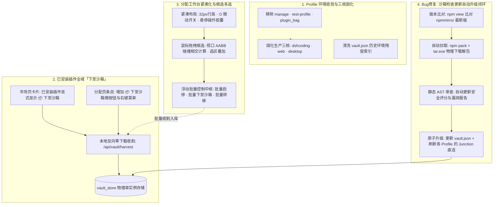

# godsh 生产环境精炼、全域下至沙箱、分配页紧凑框选与沙箱自动更新整体方案

> **方案状态**：执行落地中 (In Execution)  
> **版本**：godsh v0.5.2  
> **J-Space 工作区账本**：已登记并同步更新 (`.jspace/WORKSPACE.md` & `.jspace/history.json`)  
> **包含模块**：  
> 1. Profile 环境收敛：安全清理冗余环境，仅保留 `dshcoding`, `web`, `desktop` 三大生产核心  
> 2. 全域已安装插件「下至沙箱」双轨闭环（市场页 + 分配页 + 反向收割 API）  
> 3. 插件分配工作台高密度紧凑化布局（32px行高、状态微动开关、悬停操作胶囊）  
> 4. 插件分配工作台鼠标框选（Marquee Box Selection）多选引擎与浮动批量控制中枢  
> 5. Bug 修复：沙箱检查更新实现自动下载解包、静态安全审计与挂载环境原子升级全闭环  

---

## 一、 系统架构与闭环全景

---

## 二、 模块详细实施方案

### 1. Profile 瘦身与三核固化
- **清理清单**：
  - `~/.dsh/profiles/manage`（已移出）
  - `~/.dsh/profiles/test-profile`（已移出）
  - `~/.dsh/profiles/plugin_bag`（历史收纳袋，资产已全量归档至 Vault）
  - `~/.dsh/profiles/dsh-update-checker-backups`（归档至 `~/.dsh/backups`）
- **保留生产三核**：
  - `dshcoding`（AI 编程开发环境，14 个插件）
  - `web`（Web UI 服务环境，21 个插件）
  - `desktop`（桌面端原生环境）
- **元数据同步**：
  - 清洗 `vault.json` 中 `installedProfiles` 对废弃环境的残留引用，刷新 `invalidateProfileCache`。

### 2. 已安装插件全域「下至沙箱」
- **市场页（MarketPage）**：
  - 当插件已安装在当前 Profile（`installed === true`）时，若未在沙箱中，显式展示 `[ 📦 下至沙箱 ]` 按钮；
  - 点击后优先通过 `/api/vault/harvest` 从本地环境中快速收割入库（零网络流量消耗，毫秒级完成）；若已在沙箱中则显示 `[ 📦 沙箱就绪 ]` 徽标。
- **分配页（AllocationsPage）**：
  - 每行插件增加微型「📦 下至沙箱」按钮及右键菜单选项；
  - 配合框选支持「批量下至沙箱」。

### 3. 分配工作台紧凑化重构
- **行高压缩**：`.alloc-row` 尺寸由 46px 压缩至 32px，内边距压缩至 `3px 8px`，去除冗余大边框；
- **操作按钮胶囊化**：将横排 6 个文字大按钮改造为状态微动开关 `⏻` + 鼠标悬停显现的轻量图标组 `[↑][↓][📦][🔄][✕][🗑️]`，配备完整 Tooltip；
- **面板收折与密度切换**：默认折叠顶部旧沙箱大面板（引导至独立 Vault Hub），页面顶部提供「紧凑视图 (Compact)」与「舒适视图」切换开关，首屏可见插件数量提升 300%。

### 4. 鼠标拖拽框选（Marquee Box Selection）多选引擎
- **触发机制**：鼠标在卡片或列表空白区域按住拖拽，动态渲染跟随鼠标的半透明虚线选区矩形；拖拽排序手柄 `⠿` 独立工作，两者互不干扰；
- **碰撞相交算法**：实时计算选框视口坐标与可见 `.alloc-row` 的 `getBoundingClientRect()` 是否相交，相交条目即时加入选区高亮；
- **多选交互**：支持按住 `Shift` 范围选、`Ctrl` 反选，以及条目 Checkbox 联动；
- **浮动批量控制中枢**：选中插件后底部平滑滑出控制栏：
  - `已选中 N 项`
  - `⚡ 批量启用` / `⏸ 批量禁用`
  - `📦 批量下至沙箱`
  - `🚚 批量转移到...`
  - `✕ 批量移除分配`
  - `取消全选 (Esc)`

### 5. Bug 修复：沙箱检查更新自动升级全闭环
- **痛点根因**：原 `checkUpdates()` 仅在内存中标记 `hasUpdate: true`，缺乏真实的物理包下载更新、多版本落盘与环境挂载同步逻辑；前端亦无一键更新入口。
- **闭环实现**：
  - **下载引擎**：利用本地就绪的 `npm pack` 与 Windows 原生 `tar.exe`，免去全套 pnpm install 漫长耗时，秒级将新版本提取至 `vault_store/<pkg>@<latestVersion>`；
  - **静态安全体检**：解包后自动运行 AST 语法树安全扫描，生成新的安全评级与报告；
  - **环境原子升级**：若该插件已被挂载至一个或多个 Profile，自动原子切换其 NTFS Junction 软链至新版本目录，并更新目标环境 `package.json` 中的版本声明；
  - **前端交互**：
    - VaultHub 顶部提供「⚡ 自动更新全部」；
    - 列表中显示新版本号的条目提供「⬆️ 立即更新」；
    - AllocationsPage 检查更新后支持一键全量升级。

---

## 三、 执行落地计划

1. **Step 1**：执行 Profile 物理清理与元数据索引同步。
2. **Step 2**：落地后端沙箱下载更新与挂载环境原子升级（`updatePlugin` / `updateAll`）。
3. **Step 3**：打通前端市场页与分配页已安装插件「下至沙箱」功能。
4. **Step 4**：重构 AllocationsPage 紧凑样式与鼠标框选多选控制条。
5. **Step 5**：运行全套自动化测试、前端打包与后端编译，完成全量交付。
