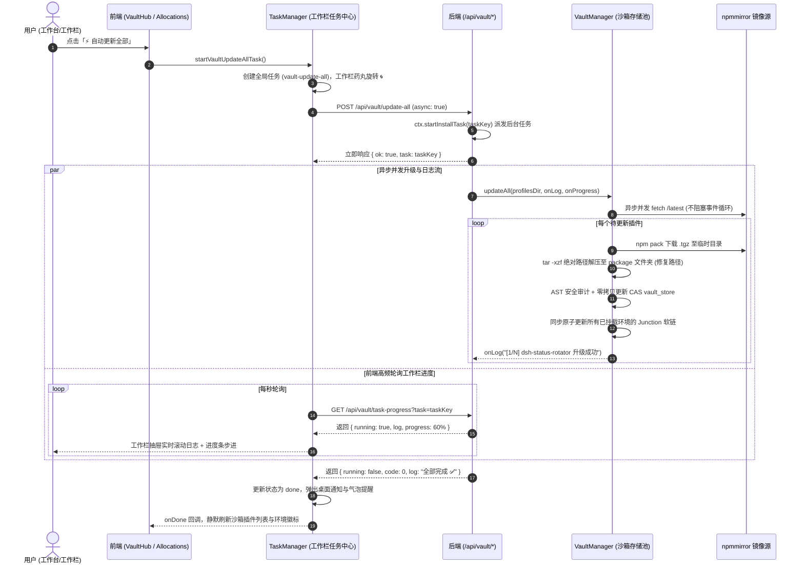

# godsh 沙箱自动更新失效修复与工作栏任务通知全闭环方案

> **方案状态**：执行落地 (In Execution)  
> **版本**：godsh v0.5.4+  
> **J-Space 工作区**：已对齐 `.jspace/WORKSPACE.md` 与 `.jspace/history.json`  
> **核心目标**：彻底根治沙箱插件自动更新下载解包失效与主线程阻塞超时两大根因；全面打通前端全局任务中心（工作栏）、流式日志轮询与系统通知闭环。

---

## 一、 问题背景与根因复核审查 (Root Causes Audit)

### 1. 沙箱自动更新失效根因
| 缺陷序号 | 隐患模块 | 源码位置 | 根因与破坏机理 | 危害等级 |
| :--- | :--- | :--- | :--- | :--- |
| **BUG-01** | `@godsh/plugin-registry` | `vault.ts:1057` | `const tarRes = runSync('tar', ['-xzf', tgzFile, '-C', tmpPackDir])`。 `tgzFile` 为相对文件名（如 `dsh-status-rotator-0.7.1.tgz`），`runSync` 未设置 `{ cwd: tmpPackDir }`，导致 Windows `tar.exe` 在项目根目录寻找压缩包，报错 `Failed to open: No such file or directory`。物理包解压 100% 失败。 | **P0 致命**（导致所有沙箱更新必定报错） |
| **BUG-02** | `@godsh/plugin-registry` | `vault.ts:869` | `checkUpdates()` 使用 `runSync('npm', ['view', ...])` 对 59 个插件进行**单线程串行同步阻塞**派生进程。耗时长达 90 秒，彻底霸占 Node.js 事件循环，导致 HTTP 请求超时中断或页面假死。 | **P0 致命**（导致网络挂起与超时） |
| **BUG-03** | `apps/launcher` | `routes/vault.ts:188, 204` | `/api/vault/update` 与 `/api/vault/update-all` 为纯同步单次请求。更新多插件耗时极长，前端直接遭遇 30s 请求超时，缺乏后台常驻任务与断网/切页保护。 | **P1 高危**（导致长任务断链） |

### 2. 未通知工作栏根因
| 缺陷序号 | 隐患模块 | 源码位置 | 根因与机理 | 影响范围 |
| :--- | :--- | :--- | :--- | :--- |
| **BUG-04** | `apps/shell-web` | `tasks.ts` | `TaskType` 仅支持 `update-all`（环境）、`batch-install`、`workflow` 等，未定义 `vault-update-all` 与 `vault-update`，缺少沙箱任务接入点。 | 全局任务系统脱节 |
| **BUG-05** | `apps/shell-web` | `VaultHubPage.tsx:290` `AllocationsPage.tsx:791` | 页面直接调用 `api.vaultUpdateAll()` 阻塞等待，未调用 `taskManager`。右下角工作栏小药丸（`TaskCenter`）没有旋转微标、没有任务计数、抽屉无日志回显、切页后状态丢失。 | 工作栏无通知无反馈 |

---

## 二、 架构设计与闭环全景图

---

## 三、 逐项落地改造方案

### 1. 修复底层引擎：`@godsh/plugin-registry` (`vault.ts`)
1. **彻底修复 `tar` 解压路径**：
   - 使用完整绝对路径 `fullTgzPath = join(tmpPackDir, tgzFile)`；
   - 显式传入 `{ cwd: tmpPackDir }`；
   - 增强对非标准解压目录名的容错探测（支持直接包含 `package.json` 的子目录）。
2. **轻量异步并发探测版本 (`checkUpdates`)**：
   - 废除阻塞主进程的 `runSync('npm', ['view', ...])`；
   - 采用原生 `fetch` 请求 `https://registry.npmmirror.com/${encodeURIComponent(name)}/latest`，配合 `AbortSignal.timeout(4000)`；
   - 采用 6 路并发控制池，2 秒内极速探测完全量 59 个插件，零卡顿零阻塞。
3. **支持日志与进度回调**：
   - 为 `updatePlugin` 与 `updateAll` 增加 `onLog?: (msg: string) => void` 参数，使每个步骤的实时状态可注入外部日志流。

### 2. 路由层异步任务化：`apps/launcher` (`routes/vault.ts`)
1. **`POST /api/vault/update-all`**：
   - 增加异步任务模式：调用 `ctx.startInstallTask(taskKey, logName, async (log) => { ... })`；
   - 立即返回 202 Accepted 与 `{ ok: true, task: taskKey, message: '沙箱自动更新任务已启动' }`；
2. **`POST /api/vault/update`**：
   - 同样支持 `ctx.startInstallTask` 派发后台任务；
3. **`GET /api/vault/task-progress`**：
   - 接收 `task` 参数，调用 `ctx.installTaskView(task)` 返回实时进度、运行状态与累积日志。

### 3. 前端工作栏全面纳管：`apps/shell-web` (`tasks.ts` & `TaskCenter.tsx`)
1. **扩展全局任务模型**：
   - `TaskType` 增加 `'vault-update-all' | 'vault-update'`；
2. **实现 `taskManager.startVaultUpdateAllTask` 与 `startVaultUpdatePluginTask`**：
   - 启动任务并推入工作栏状态管理器；
   - 1 秒高频轮询 `/api/vault/task-progress`；
   - 根据日志标记动态计算进度百分比；
   - 完成后触发 `onDone`、刷新视图并发出系统级桌面通知（Web Notification）；
3. **增强工作栏交互组件 (`TaskCenter.tsx`)**：
   - 呈现专属 `📦 沙箱插件全量更新` 与 `⬆️ 升级插件` 卡片；
   - 呈现旋转状态徽标、进度条与流式实时终端日志抽屉。

### 4. 页面操作全面接入工作栏：`VaultHubPage.tsx` & `AllocationsPage.tsx`
1. **`VaultHubPage.tsx`**：
   - `handleUpdateAll()`：调用 `taskManager.startVaultUpdateAllTask()`，移交全局工作栏；
   - `handleUpdateSingle(p)`：调用 `taskManager.startVaultUpdatePluginTask(p.id, p.name, p.latestVersion)`；
   - 监听任务完成事件，自动静默刷新页面数据。
2. **`AllocationsPage.tsx`**：
   - `handleCheckVaultUpdates()`：用户确认后调用 `taskManager.startVaultUpdateAllTask()`，联动工作栏，分配页内同步回显。

---

## 四、 实施与验证清单 (Verification Plan)

| 验证项 | 验证手段 | 预期结果 |
| :--- | :--- | :--- |
| **单测：tar 路径与解压** | `node --import tsx --test packages/plugin-registry/src/vault.test.ts` | `updatePlugin` 成功解压并部署落地，单测 100% 通过 |
| **单测：异步并发检查更新** | 专项单测模拟 npmmirror 异步比对 | 零阻塞，秒级完成版本差异探测 |
| **接口：异步任务与进度** | HTTP 测试 `/api/vault/update-all` 与 `/api/vault/task-progress` | 202 快速响应 taskKey，轮询返回真实日志流与完成状态 |
| **端到端：工作栏通知与日志** | 前端界面触发自动更新 | 右下角 `TaskCenter` 药丸旋转 `🌀 1 个任务运行中`，抽屉内显示流式解压日志与百分比，完成后提示通知 |
| **全量回归** | `pnpm run typecheck` + `pnpm test` | 全仓 60+ 单测全绿，TS 0 错误 |
