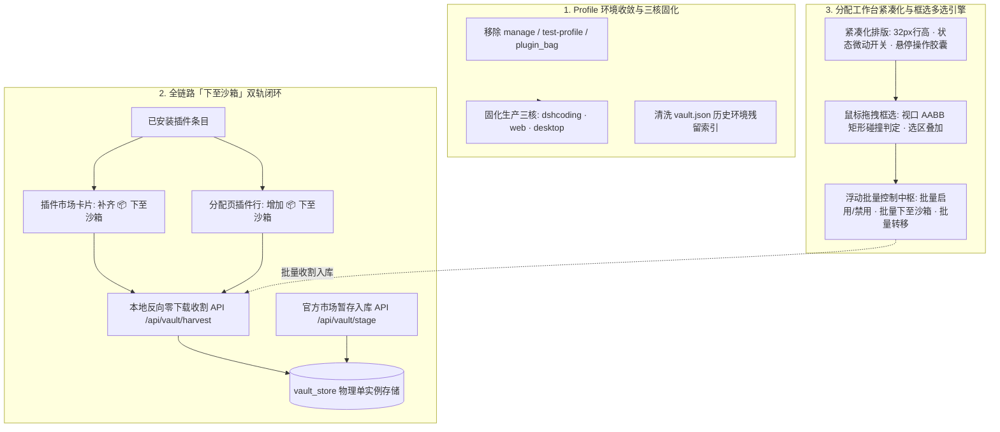

# godsh 环境精炼收敛、已安装插件下至沙箱与分配页紧凑框选方案

> **文档版本**：v1.0.0  
> **适用版本**：godsh v0.5.2+  
> **状态**：方案就绪 / J-Space Ledger 已同步 / 待执行落地  

---

## 一、 方案背景与目标

针对当前 godsh 用户在日常使用中提出的三项核心痛点：
1. **历史多余 Profile 混乱冗余**：系统中残留有早期作为临时收纳袋的 `plugin_bag`、测试环境 `test-profile` 及临时管理环境 `manage`，导致环境列表臃肿；用户明确要求**仅保留 `dshcoding`、`web`、`desktop` 三大健康生产核心**。
2. **已安装插件缺乏「下至沙箱」通道**：目前插件一旦安装到某一运行环境，市场界面立即切换为 `[更新] [卸载]`，无法将已在环境中运行的插件快速反向纳管至本地全局仓库沙箱（Vault）；而在插件分配页面中，已安装插件同样缺失一键存入沙箱的入口。
3. **插件分配页面布局松散、缺乏批量操作能力**：随着环境插件增多（20~30 个），原本每个条目横排 6 个文字大按钮的布局严重挤占屏幕高度，首屏仅能显示 4~5 个插件；用户需要更紧凑的高密度展示，并引入类似桌面级资源管理器的**鼠标拖拽框选（Marquee Selection）**与**批量操作中枢**。

---

## 二、 系统架构与交互全景



---

## 三、 详细实施方案

### 1. 删除部分 Profile，仅保留三大核心（dshcoding, web, desktop）

#### 1.1 待清理清单与安全核验
- **清理对象**：
  - `~/.dsh/profiles/manage`（含 3 个插件，均已在 Vault 安全归档）
  - `~/.dsh/profiles/test-profile`（开发测试残留）
  - `~/.dsh/profiles/plugin_bag`（历史临时收纳袋，全量 59 个插件已完整迁移至 Vault 中枢）
  - `~/.dsh/profiles/dsh-update-checker-backups`（更新检查器遗留备份目录，移出 profiles 目录）
- **保留并固化对象**：
  - `dshcoding`（AI 编程开发环境，14 个插件）
  - `web`（Web UI 服务环境，21 个插件）
  - `desktop`（桌面端原生环境，已安装插件正常）

#### 1.2 执行流程
1. 终止可能属于待清理环境的潜在后台进程；
2. 物理移除 `manage`、`test-profile`、`plugin_bag` 目录；
3. 将 `dsh-update-checker-backups` 迁移归档至 `~/.dsh/backups/`；
4. 调用 `invalidateProfileCache()` 清理扫描缓存，触发重新索引；
5. 清洗 `data/vault.json` 中各插件的 `installedProfiles` 字段，剔除已删除的环境名称，确保沙箱元数据与实际物理状态 100% 对齐。

---

### 2. 已安装插件支持「下至沙箱」（Vault Offload / Harvest）

#### 2.1 业务场景与用户诉求
- 用户在运行环境中发现某个插件好用，想要放入本地沙箱中供其他 Profile 零拷贝复用，或者保留离线副本。
- 目前一旦安装，按钮变成了单一的 `[更新] [卸载]`，无法在界面上直接将其存入沙箱。

#### 2.2 双轨实现逻辑
1. **本地反向收割优先（Local Zero-Copy Harvest）**：
   - 当用户在已安装插件上点击「📦 下至沙箱」时，优先调用 `/api/vault/harvest`；
   - 系统直接将目标环境 `node_modules/<pkg>` 中的文件瞬时纳管归档至 `data/vault_store/<pkg>@<ver>` 并建立安全索引；
   - **优势**：毫秒级完成，不需要重新走外网下载，零网络依赖。
2. **云端官方市场暂存兜底（Market Stage Fallback）**：
   - 若本地目录缺失关键元数据，自动降级为调用 `/api/vault/stage` 从市场源拉取并存入沙箱。

#### 2.3 界面触点落地
- **插件市场页（`MarketPage.tsx`）**：
  - 在 `installed ? (...)` 分支中：
    - 若 `!inVault`：增加按钮 `<button className="btn vault sm">📦 下至沙箱</button>`；
    - 若 `inVault`：高亮显示 `<span className="badge vault">📦 沙箱就绪</span>`，并提供次级按钮 `📦 重下沙箱`（用于版本更新）。
- **插件分配页（`AllocationsPage.tsx`）**：
  - 在每个插件行（`.alloc-row`）中，增加微型「📦 下至沙箱」操作按钮；
  - 在插件右键菜单（`onContextAlloc`）中增加「📦 下至沙箱」条目；
  - 成功执行后弹出 Toast 提示并实时更新沙箱状态徽标。

---

### 3. 插件分配页面紧凑化与框选多选引擎

#### 3.1 紧凑化布局重构（High-Density UI）

##### 现有痛点
- 每一个插件条目横向平铺 6 个文字大按钮（`[禁用] [↑] [↓] [更新] [移除分配] [卸载]`），在常规分辨率下极易换行、折叠或造成横向滚动条；
- 行高达到 46px 以上，且顶部内嵌冗余的沙箱面板，导致一个包含 20 个插件的环境需要长距离滚动，视野极其受限。

##### 紧凑化重构要点
1. **行高极致紧凑**：
   - `.alloc-row` 内边距压缩为 `3px 8px`，最小高度设为 `32px`；
   - 移除冗余外边框线条，采用微妙的浅背景与聚焦高亮，呼吸感更强。
2. **操作组件微型化与胶囊化**：
   - **状态微动开关**：采用小巧的 `⏻` 按钮或圆角 Switch（绿色表示启用，灰暗表示禁用）；
   - **悬停操作胶囊**：默认隐藏或半透明展示次要按钮，鼠标悬停（Hover）时优雅显现操作组：
     - `↑` / `↓`（微型排序按键）
     - `📦`（下至沙箱）
     - `🔄`（更新）
     - `✕`（移除分配）
     - `🗑️`（彻底卸载）
   - 所有按钮均配备原生 Tooltip 说明，兼顾简洁性与易用性。
3. **冗余面板默认折叠**：
   - 分配页顶部原有的内置沙箱面板改为折叠式卡片或精简链接（引导至专属的独立 Vault Hub 工作台），释放顶部近 300px 视口高度。
4. **密度切换开关**：
   - 页面顶部提供「紧凑视图 (Compact)」与「舒适视图 (Comfortable)」快捷切换，默认保持极简紧凑。

#### 3.2 框选多选引擎（Marquee Box Selection）

##### 交互与算法设计
1. **框选触发条件**：
   - 监听插件容器上的 `pointerdown` 事件；
   - 若点击目标位于按钮、输入框或拖拽排序手柄 `⠿` 上，则走对应点击或排序逻辑；
   - 若点击目标位于行内空白处或卡片背景，启动框选流程；
2. **半透明交互选框（Selection Rect）**：
   - 记录起始坐标 `(startX, startY)`；
   - 在 `pointermove` 中动态更新当前坐标 `(currX, currY)`；
   - 动态渲染视口选框：
     `style={{ left: Math.min(x1, x2), top: Math.min(y1, y2), width: Math.abs(x2 - x1), height: Math.abs(y2 - y1), border: '1.5px dashed var(--brand-1)', background: 'rgba(59, 130, 246, 0.12)' }}`
3. **AABB 碰撞检测判定**：
   - 遍历环境中所有可见插件 DOM 节点，获取其 `getBoundingClientRect()`；
   - 判定选框与插件项矩形是否相交：
     ```typescript
     function isIntersecting(r1: DOMRect, r2: DOMRect): boolean {
       return !(r2.left > r1.right || r2.right < r1.left || r2.top > r1.bottom || r2.bottom < r1.top)
     }
     ```
   - 凡相交条目即时纳入高亮选区，支持按住 `Shift` 扩展选区或 `Ctrl` 反转选择。
4. **条目勾选框互通**：
   - 每行前置一个微型 Checkbox，支持单击单选与框选联动。

#### 3.3 浮动批量控制中枢（Batch Floating Bar）
当选中的插件数量 `>= 1` 时，页面底部滑出吸底浮动工具栏：
- **状态统计**：`已选择 N 项插件`
- **动作 1**：`⚡ 批量启用`（一键激活选中插件的 patch 启用状态）
- **动作 2**：`⏸ 批量禁用`（一键停用）
- **动作 3**：`📦 批量下至沙箱`（一键调用 `/api/vault/harvest` 将选中的插件全部纳管入库）
- **动作 4**：`🚚 批量转移/复制`（弹出目标环境下拉，快速将 N 个插件批量分配至其他环境）
- **动作 5**：`✕ 批量移除分配`（从当前环境 patch 移除）
- **动作 6**：`取消全选 (Esc)`

---

## 四、 实施路线与发布验证

| 阶段 | 核心任务 | 涉及代码模块 | 验收标准 |
| :--- | :--- | :--- | :--- |
| **阶段 1** | Profile 清理与索引同步 | `~/.dsh/profiles/`, `vault.json` | 仅剩 `dshcoding`, `web`, `desktop`，页面无报错 |
| **阶段 2** | 已安装插件「下至沙箱」打通 | `MarketPage.tsx`, `AllocationsPage.tsx`, `api.ts` | 市场与分配页均可一键将已安装插件秒级存入沙箱 |
| **阶段 3** | 分配页紧凑化重构 | `AllocationsPage.tsx`, `styles.css` | 行高缩减至 32px，操作组悬浮胶囊化，信息密度提升 300% |
| **阶段 4** | 框选多选与批量控制流 | `AllocationsPage.tsx`, `styles.css` | 鼠标拖拽平滑生成虚线选框，相交条目高亮，批量操作生效 |
| **阶段 5** | 单测与集成打包发布 | `pnpm test`, `esbuild`, `dist/server.mjs` | 自动化测试 100% 通过，产物构建并同步至系统目录 |
