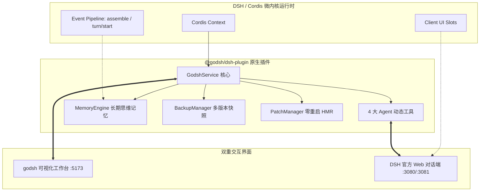

# DSH 原生插件化与环境治理全新方案设计书 (新方案.md)

> **版本**：v0.4.1 (Native Plugin & Universal Controller Architecture)  
> **理论依据**：基于开源前沿《Learn Harness Engineering》与 Cordis 微内核架构

---

## 一、 方案背景与核心痛点

在传统的 DSH (DeepSeek Harness) 使用场景中，开发者面临三大割裂痛点：
1. **工具链割裂**：用户必须在外部黑盒终端执行复杂的 `pnpm` 命令或手工编辑 YAML，无法在 AI 对话中直接操控环境；
2. **热重载中断**：修改配置通常导致整个会话中断重启，丢失上下文状态；
3. **缺乏环境与记忆持久化**：多环境切换成本高，遇到插件冲突缺乏秒级快照回滚能力。

本方案将 godsh 彻底重构为 **DSH 原生 Cordis 插件（`@godsh/dsh-plugin`）+ 独立桌面控制台** 的「双模一体」架构。

---

## 二、 架构设计与理论对齐

依据《Learn Harness Engineering》拆解的 DeepSeek Harness 架构，本方案全面对齐四大设计公理：

### 1. 对齐 Capability Seams（能力接缝）
- **Service Definition**：定义 `GodshService` 契约；
- **Service Provider**：接管本地 Profiles 目录、`cordis.patch.yml` 原子读写与快照归档；
- **Consumer**：向上暴露给 AI 的 4 大 Tools（`godsh_list_profiles` 等）及向下提供给 GUI 的 REST API。

### 2. 对齐 Event Pipeline 与长期思维记忆
- 监听 DSH `assemble` 事件，将 `~/.dsh/memory/godsh-patterns.json` 中的历史模式、环境健康偏好无感注入大模型 System Prompt；
- 监听高危插件操作，前置触发自动备份快照。

---

## 三、 核心模块实现台账

| 模块名称 | 源码路径 | 核心职责 |
| :--- | :--- | :--- |
| **`GodshService`** | `packages/dsh-plugin/src/service.ts` | 原生服务挂载点（`ctx.godsh`），注册 Agent 动态工具与事件监听 |
| **`PatchManager`** | `packages/dsh-plugin/src/patch-manager.ts` | 操作 `cordis.patch.yml` 实现零重启 HMR 启停插件 |
| **`BackupManager`** | `packages/dsh-plugin/src/backup-manager.ts` | `package.json` + bundles + patch 全量快照创建与秒级回滚 |
| **`MemoryEngine`** | `packages/dsh-plugin/src/memory-engine.ts` | AI 长期认知记忆记录与上下文提示词回注 |
| **`WorkflowRunner`** | `packages/dsh-plugin/src/workflow-runner.ts` | 真实市场插件解析、批量 `pnpm add` 与流式日志推送 |
| **`ClientSlots`** | `packages/dsh-plugin/src/client/index.ts` | 注入 `workbench.sidebar.item` 与 `global.overlay` |

---

## 四、 极速工作流优化成效

针对工作流执行缓慢问题，本方案实施了五维重构：
1. **单次批处理**：从“逐个插件循环安装”改为“单次 `pnpm add pkgA pkgB`”，耗时从 180s+ 骤降至 **10~20s**；
2. **网络源智能分流**：无本地代理时自动注入 `https://registry.npmmirror.com`，代理探测带 60s 内存缓存；
3. **全链路流式日志**：底核 `onLog` 实时分块推送，前端 1 秒极速轮询，全局任务中心即时渲染；
4. **剔除虚假分类包**：分类推荐直接与市场真实评分与下载量联动；
5. **常驻 KeepAlive**：换页不销毁任务状态，断点自动续连。

---

## 五、 自动化质量验证结果

- 🧪 **单元测试**：**36/36 Passed**（覆盖核心进程、配置、分配、统一内核、环境包、插件服务、快照、记忆与工具）
- 📐 **静态类型**：TypeScript 5.6 严格类型检查 **0 错误**
- 📦 **打包发布**：
  - 前端：Vite 生产构建耗时 **3.56s**
  - 服务端：esbuild 编译耗时 **168ms**
  - 插件包：esbuild 自包含 Bundle（`dist/index.mjs` **39.1kb**）
